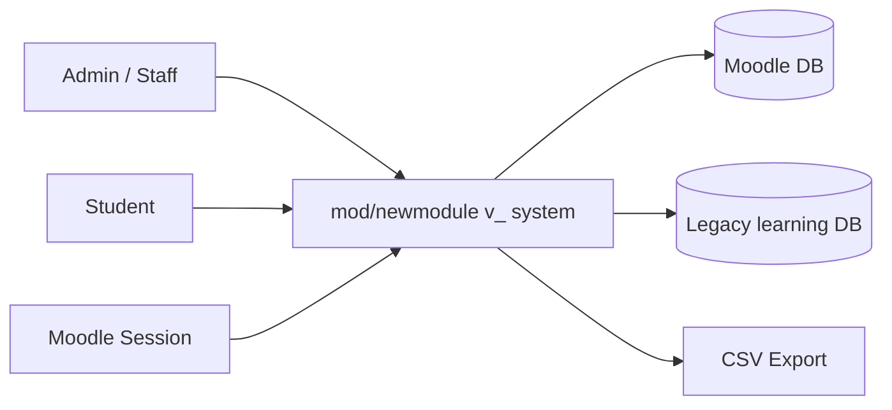
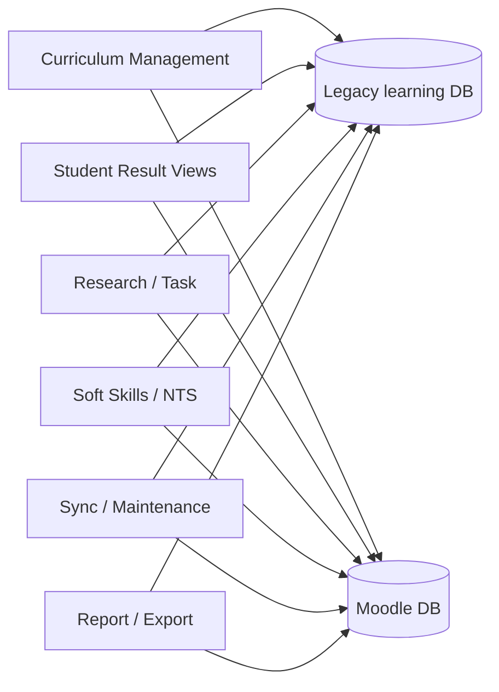
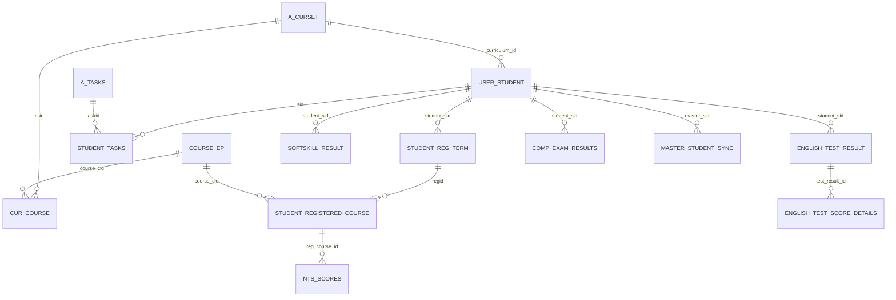

# Newmodule v_ Survey Draft

Last updated: 2026-07-27

## Scope

This draft covers the `v_`-prefixed part of `mod/newmodule` and the related helper/API files that support those screens.

Included:
- Active screen pages such as `v_index.php`, `v_softskills.php`, `v_nts.php`, `v_research.php`, curriculum management pages, student detail pages, and report pages
- Helper files in `includes/`
- Backend actions and API files in `api/`
- Database views defined in `sql/create_milepoint_views.sql`
- The Moodle module table defined in `db/install.xml`

Excluded from the main user manual:
- Backup copies and dated variants such as `*250923.php`, `*260224.php`, `*260526*.php`, and `*bk*.php`
- Experimental or historical copies, unless they are still the active entry point

## Recommended Manual Structure

Use three layers instead of one huge document:

1. User Manual
   - Screen-by-screen behavior
   - Buttons and actions
   - Step-by-step procedures

2. Technical Reference
   - Table dictionary
   - Relation map
   - Views
   - API/helper dependencies

3. Appendix
   - Old/backup files
   - SQL deployment notes
   - Environment notes
   - Troubleshooting and logs

## System Model Summary

The plugin is split into two data layers:

- Moodle activity layer
  - Minimal module table: `newmodule`
  - Defined in `db/install.xml`

- Legacy learning database layer
  - Most business data lives in external `mdl_*` tables
  - Connected through `config-condata-elearning.php`
  - Used by page files, helper files, API files, and SQL views

This is important for documentation because the plugin is not self-contained in Moodle DB only.

## Active Screen Groups

### 1. Entry / Dashboard

Primary files:
- [v_index.php](C:\Apache24\htdocs\moodle310_dev\mod\newmodule\v_index.php)
- [v_spider.php](C:\Apache24\htdocs\moodle310_dev\mod\newmodule\v_spider.php)
- [v_knowledge.php](C:\Apache24\htdocs\moodle310_dev\mod\newmodule\v_knowledge.php)
- [v_nts.php](C:\Apache24\htdocs\moodle310_dev\mod\newmodule\v_nts.php)
- [v_research.php](C:\Apache24\htdocs\moodle310_dev\mod\newmodule\v_research.php)
- [v_softskills.php](C:\Apache24\htdocs\moodle310_dev\mod\newmodule\v_softskills.php)

Main purpose:
- Select curriculum
- View overall milepoint dashboard
- Jump into the major score domains

Common actions:
- Choose `setid`
- Open each score domain
- Navigate back to home or curriculum context

### 2. Curriculum Management

Primary files:
- [v_curriculum_management.php](C:\Apache24\htdocs\moodle310_dev\mod\newmodule\v_curriculum_management.php)
- [v_manage_cur_course.php](C:\Apache24\htdocs\moodle310_dev\mod\newmodule\v_manage_cur_course.php)
- [v_manage_cur_student.php](C:\Apache24\htdocs\moodle310_dev\mod\newmodule\v_manage_cur_student.php)
- [v_manage_cur_student_detail.php](C:\Apache24\htdocs\moodle310_dev\mod\newmodule\v_manage_cur_student_detail.php)
- [v_edit_cur.php](C:\Apache24\htdocs\moodle310_dev\mod\newmodule\v_edit_cur.php)
- [v_edit_task.php](C:\Apache24\htdocs\moodle310_dev\mod\newmodule\v_edit_task.php)
- [v_edit_tasks_research.php](C:\Apache24\htdocs\moodle310_dev\mod\newmodule\v_edit_tasks_research.php)
- [v_edit_tasks_research_list.php](C:\Apache24\htdocs\moodle310_dev\mod\newmodule\v_edit_tasks_research_list.php)
- [v_manage_student_research.php](C:\Apache24\htdocs\moodle310_dev\mod\newmodule\v_manage_student_research.php)
- [v_manage_softskills.php](C:\Apache24\htdocs\moodle310_dev\mod\newmodule\v_manage_softskills.php)
- [v_manage_ce_results.php](C:\Apache24\htdocs\moodle310_dev\mod\newmodule\v_manage_ce_results.php)
- [v_edit_student_nts.php](C:\Apache24\htdocs\moodle310_dev\mod\newmodule\v_edit_student_nts.php)

Main purpose:
- Configure curriculum master data
- Assign courses and students to a curriculum
- Lock/unlock curriculum setup
- Maintain task, research, soft skill, and CE result configurations

Common actions:
- Open the curriculum selector
- Add or remove courses
- Add or remove students
- Save changes
- Lock/unlock the curriculum

### 3. Student Result Views

Primary files:
- [v_view_student_courses.php](C:\Apache24\htdocs\moodle310_dev\mod\newmodule\v_view_student_courses.php)
- [v_view_student_knowledge.php](C:\Apache24\htdocs\moodle310_dev\mod\newmodule\v_view_student_knowledge.php)
- [v_view_student_nts.php](C:\Apache24\htdocs\moodle310_dev\mod\newmodule\v_view_student_nts.php)
- [v_view_student_research.php](C:\Apache24\htdocs\moodle310_dev\mod\newmodule\v_view_student_research.php)
- [v_view_report.php](C:\Apache24\htdocs\moodle310_dev\mod\newmodule\v_view_report.php)
- [v_list_englishskills.php](C:\Apache24\htdocs\moodle310_dev\mod\newmodule\v_list_englishskills.php)
- [v_list_tasks_research.php](C:\Apache24\htdocs\moodle310_dev\mod\newmodule\v_list_tasks_research.php)

Main purpose:
- Show per-student outcomes
- Filter by curriculum, study plan, year, or other criteria
- Export summaries

Common actions:
- Search/filter
- Reset filters
- Open student detail pages
- Export CSV/report

### 4. Sync / Maintenance

Primary files:
- [v_sync_data_management.php](C:\Apache24\htdocs\moodle310_dev\mod\newmodule\v_sync_data_management.php)
- [v_student_sync_controller.php](C:\Apache24\htdocs\moodle310_dev\mod\newmodule\v_student_sync_controller.php)
- [v_sync_student_dup_management.php](C:\Apache24\htdocs\moodle310_dev\mod\newmodule\v_sync_student_dup_management.php)
- [v_sync_registration_term.php](C:\Apache24\htdocs\moodle310_dev\mod\newmodule\v_sync_registration_term.php)
- [v_sync_registered_course.php](C:\Apache24\htdocs\moodle310_dev\mod\newmodule\v_sync_registered_course.php)
- [v_sync_couse_master_script.php](C:\Apache24\htdocs\moodle310_dev\mod\newmodule\v_sync_couse_master_script.php)
- [v_recalculate_all_grades.php](C:\Apache24\htdocs\moodle310_dev\mod\newmodule\v_recalculate_all_grades.php)
- [v_sort_student_courses.php](C:\Apache24\htdocs\moodle310_dev\mod\newmodule\v_sort_student_courses.php)
- [v_update_task_order.php](C:\Apache24\htdocs\moodle310_dev\mod\newmodule\v_update_task_order.php)
- [v_ajax_process_sync.php](C:\Apache24\htdocs\moodle310_dev\mod\newmodule\v_ajax_process_sync.php)

Main purpose:
- Sync student data
- Resolve duplicate student records
- Recalculate derived grades
- Maintain ordering and consistency of records

### 5. API / Helper Layer

Primary files:
- [api/v_course_actions.php](C:\Apache24\htdocs\moodle310_dev\mod\newmodule\api\v_course_actions.php)
- [api/v_fetch_english_test_data.php](C:\Apache24\htdocs\moodle310_dev\mod\newmodule\api\v_fetch_english_test_data.php)
- [api/v_get_all_nts_summaries.php](C:\Apache24\htdocs\moodle310_dev\mod\newmodule\api\v_get_all_nts_summaries.php)
- [api/v_get_knowledge_summaries.php](C:\Apache24\htdocs\moodle310_dev\mod\newmodule\api\v_get_knowledge_summaries.php)
- [api/v_get_nts_data.php](C:\Apache24\htdocs\moodle310_dev\mod\newmodule\api\v_get_nts_data.php)
- [api/v_get_template_tasks.php](C:\Apache24\htdocs\moodle310_dev\mod\newmodule\api\v_get_template_tasks.php)
- [api/v_recalculate_all_grades.php](C:\Apache24\htdocs\moodle310_dev\mod\newmodule\api\v_recalculate_all_grades.php)
- [api/v_save_nts_scores.php](C:\Apache24\htdocs\moodle310_dev\mod\newmodule\api\v_save_nts_scores.php)
- [api/v_sort_student_courses.php](C:\Apache24\htdocs\moodle310_dev\mod\newmodule\api\v_sort_student_courses.php)
- [api/v_sync_registered_course.php](C:\Apache24\htdocs\moodle310_dev\mod\newmodule\api\v_sync_registered_course.php)
- [api/v_sync_registration_term.php](C:\Apache24\htdocs\moodle310_dev\mod\newmodule\api\v_sync_registration_term.php)
- [api/v_update_task_order.php](C:\Apache24\htdocs\moodle310_dev\mod\newmodule\api\v_update_task_order.php)
- [includes/v_knowledge_functions.php](C:\Apache24\htdocs\moodle310_dev\mod\newmodule\includes\v_knowledge_functions.php)
- [includes/v_nts_functions.php](C:\Apache24\htdocs\moodle310_dev\mod\newmodule\includes\v_nts_functions.php)
- [includes/selectcur.php](C:\Apache24\htdocs\moodle310_dev\mod\newmodule\includes\selectcur.php)
- [includes/toper.php](C:\Apache24\htdocs\moodle310_dev\mod\newmodule\includes\toper.php)
- [includes/footer.php](C:\Apache24\htdocs\moodle310_dev\mod\newmodule\includes\footer.php)

Main purpose:
- Serve AJAX actions
- Return summarized data
- Keep query logic reusable
- Avoid duplicated SQL inside page files

## Button / Action Inventory Draft

Use this section as the base for the user manual. Each page should be documented with:
- button label
- location
- action
- precondition
- table impact
- result

### `v_index.php`

Known actions:
- Curriculum selection dropdown
- `จัดการนักศึกษาในหลักสูตร`
- `จัดการข้อมูลลงทะเบียน`
- `จัดการโครงสร้างหลักสูตร`
- Dashboard navigation to score domains

### `v_curriculum_management.php`

Known actions:
- Go to student management
- Go to sync management
- Go to course management
- Lock / unlock curriculum

### `v_manage_cur_course.php`

Known actions:
- Toggle curriculum lock
- Save selected courses
- Navigate back to home or curriculum management

### `v_manage_cur_student.php`

Known actions:
- Select students by checkbox
- Save student curriculum assignment
- Open student detail page

### `v_manage_cur_student_detail.php`

Known actions:
- View student profile details
- Edit or submit changes
- Navigate back to curriculum or home

### `v_softskills.php`

Known actions:
- Search student
- Clear search
- Open soft skill management page
- Open student detail / spider chart related view

### `v_manage_softskills.php`

Known actions:
- Search and filter students
- Save soft skill status
- Return to softskills dashboard

### `v_nts.php`

Known actions:
- Search student
- Clear search
- Load NTS summary table

### `v_view_report.php`

Known actions:
- Search / filter report
- Reset filter
- Export data as CSV

### `v_research.php`

Known actions:
- Open task list
- Navigate to research detail pages
- View alerts or task-related status

### `v_view_student_courses.php`, `v_view_student_knowledge.php`, `v_view_student_nts.php`, `v_view_student_research.php`

Known actions:
- Open detail pages
- Return to parent dashboard
- Jump to edit pages where allowed

## Table Inventory Draft

### Moodle module table

- `newmodule`
  - The activity-instance table defined in `db/install.xml`
  - Stores the module record, intro, grade, timestamps, and course linkage

### Core learning database tables

Curriculum and course master:
- `mdl_a_curset`
  - Curriculum master table
  - Used for curriculum code, year, type, and lock state
- `mdl_a_curset_log`
  - Log table for curriculum changes
- `mdl_a_tasks`
  - Task master table
  - Used for research/task setup
- `mdl_course_ep`
  - Course master table
  - Used as the course catalog
- `mdl_cur_course`
  - Mapping table between curriculum and course
  - Stores required/optional course placement

Student master and academic structure:
- `mdl_user_student`
  - Student master table
  - Central table for almost every `v_` screen
- `mdl_student_tasks`
  - Student-to-task table
  - Used by research/task scoring
- `mdl_student_registration_term`
  - Student registration header by term
- `mdl_student_registered_course`
  - Registered course line items
- `mdl_u_student_in_course`
  - Legacy student-course-status table used by report pages
- `mdl_u_student_in_course_for_registered_course`
  - Legacy support table for course registration related processing
- `mdl_u_education_year`
  - Academic year master
- `mdl_u_education_semester_course`
  - Semester/course mapping table
- `mdl_u_education_year_semester`
  - Academic year / semester master

Skill and score tables:
- `mdl_student_softskill_result`
  - Soft skill result by student
- `mdl_student_english_test_result`
  - English test result header
- `mdl_student_english_test_score_details`
  - English sub-scores / skill detail table
- `mdl_english_test_criteria`
  - English passing criteria by curriculum and test type
- `mdl_english_test_types`
  - English test type master
- `mdl_nts_scores`
  - NTS score table per registered course
- `mdl_nts_research_progress`
  - Research-progress scoring table
- `mdl_comp_exam_results`
  - Comprehensive examination / CE result table

Milepoint and summary:
- `mdl_milepoint`
  - Target storage table for milepoint-style summary
- `mdl_milepoint_view`
  - Final consolidated view for knowledge, research, soft skills, and NTS

Sync / duplicate management:
- `mdl_master_student_sync`
  - Mapping table for duplicate / master student records

Moodle core tables seen in the scan:
- `mdl_user`
- `mdl_course`
- `mdl_course_categories`
- `mdl_context`
- `mdl_enrol`
- `mdl_user_enrolments`
- `mdl_role_assignments`

Legacy / uncertain tables that should be verified before final publication:
- `mdl_userstatus`
- `mdl_userstatu`
- `mdl_userstatus_cer_img`

## Important Relations

### Direct relations

| From | To | Type | Meaning |
|---|---|---|---|
| `mdl_user_student.curriculum_id` | `mdl_a_curset.csid` | logical FK | Student belongs to a curriculum |
| `mdl_student_tasks.sid` | `mdl_user_student.sid` | logical FK | Student has task records |
| `mdl_student_tasks.taskid` | `mdl_a_tasks.taskid` | logical FK | Task assignment points to task master |
| `mdl_cur_course.course_cid` | `mdl_course_ep.cid` | logical FK | Curriculum-course mapping points to course master |
| `mdl_cur_course.csid` | `mdl_a_curset.csid` | logical FK | Curriculum-course mapping belongs to curriculum |
| `mdl_student_registration_term.student_sid` | `mdl_user_student.sid` | logical FK | Student registration header belongs to student |
| `mdl_student_registered_course.regid` | `mdl_student_registration_term.regid` | logical FK | Registered course belongs to term registration |
| `mdl_student_registered_course.course_cid` | `mdl_course_ep.cid` | logical FK | Registered course points to course master |
| `mdl_nts_scores.reg_course_id` | `mdl_student_registered_course.id` | logical FK | NTS score belongs to registered course |
| `mdl_nts_research_progress.student_sid` | `mdl_user_student.sid` | logical FK | Research progress belongs to student |
| `mdl_student_softskill_result.student_sid` | `mdl_user_student.sid` | logical FK | Soft skill result belongs to student |
| `mdl_student_english_test_result.student_sid` | `mdl_user_student.sid` | logical FK | English test result belongs to student |
| `mdl_student_english_test_score_details.test_result_id` | `mdl_student_english_test_result.id` | logical FK | Score detail belongs to test header |
| `mdl_comp_exam_results.student_sid` | `mdl_user_student.sid` | logical FK | CE result belongs to student |
| `mdl_master_student_sync.master_sid` | `mdl_user_student.sid` | logical FK | Sync table points to master student |

### Derived relation chain for milepoint

1. `v_student_knowledge_scores_final`
2. `v_student_research_score`
3. `v_student_nts_score`
4. `v_student_softskill_score`
5. `v_student_english_skill_score`
6. `mdl_milepoint_view`

### View dependency chain

- `v_student_course_effective_grade`
  - Uses `mdl_student_registered_course`, `mdl_student_registration_term`, `mdl_course_ep`, `v_grade_values`

- `v_student_passed_credits`
  - Uses `v_student_course_effective_grade`

- `v_student_p_scores_base`
  - Uses `mdl_user_student`, `v_student_passed_credits`

- `v_student_ce_status`
  - Uses `mdl_comp_exam_results`

- `v_student_knowledge_scores_final`
  - Uses `v_student_p_scores_base`, `v_student_ce_status`

- `v_student_research_score`
  - Uses `mdl_student_tasks`, `mdl_a_tasks`

- `v_student_nts_score`
  - Uses `mdl_student_registered_course`, `mdl_student_registration_term`, `mdl_course_ep`, `mdl_nts_scores`

- `v_student_softskill_score`
  - Uses `mdl_student_softskill_result`

- `v_student_english_skill_score`
  - Uses `mdl_student_english_test_result`

- `mdl_milepoint_view`
  - Uses all of the above summary views

## DFD Draft

### DFD Level 0

### DFD Level 1

## ER Draft

## Use Case Draft

| Use case | Actor | Main outcome |
|---|---|---|
| Select curriculum | Admin / Staff | Opens the context for all curriculum-related pages |
| View dashboard | Admin / Staff | Sees milepoint summary and student distribution |
| Manage curriculum | Admin / Staff | Creates or updates curriculum master data |
| Manage courses in curriculum | Admin / Staff | Saves course assignments and lock state |
| Manage students in curriculum | Admin / Staff | Adds or removes students from a curriculum |
| View student knowledge | Admin / Staff | Sees Knowledge score and detail |
| View student research | Admin / Staff | Sees research task progress and alerts |
| View soft skills | Admin / Staff | Sees soft skill score and status |
| View NTS | Admin / Staff | Sees NTS score summary |
| Sync duplicate student data | Admin | Resolves duplicate identities and propagates master links |
| Export report CSV | Admin / Staff | Generates a CSV report for offline use |
| Recalculate derived scores | Admin / System job | Refreshes summary data after source changes |

## Screen Documentation Template

Use the same structure for every screen:

1. Screen name
2. File path
3. Who can use it
4. Purpose
5. Inputs / filters
6. Buttons and links
7. Step-by-step use
8. Tables read
9. Tables written
10. Logs and errors
11. Related screens

## Table Documentation Template

Use the same structure for every table or view:

1. Table / view name
2. Type: table or view
3. Owner layer: Moodle DB or legacy learning DB
4. Purpose
5. Main columns
6. PK / FK / logical relation
7. Who reads it
8. Who writes it
9. Example queries
10. Notes / risks

## Notes Worth Carrying into the Final Manual

- Many pages still use legacy `mysqli` and some use `PDO`; document this as a deliberate compatibility choice for now.
- Keep the main manual focused on active files only.
- Move dated backup copies into an appendix, not the main navigation map.
- The external connection helper should remain the single place that knows how to connect to the learning DB.
- Logs should be described only for meaningful failures, not every routine query.
- Use standard Moodle footer and page lifecycle in the documentation examples.

## Suggested Next Step

If the next pass is accepted, the cleanest order is:

1. Finish the screen-by-screen manual for the active pages only
2. Expand the table reference with column-level details
3. Draw the final ER and DFD diagrams
4. Put backup and historical files into appendix
